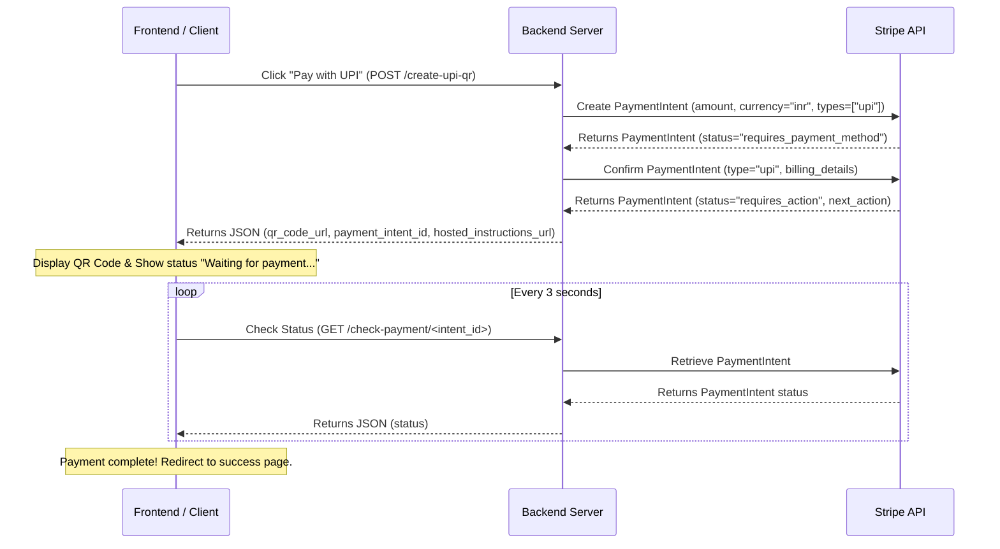

# Stripe UPI QR Code Integration Guide

This document describes how to implement a custom UPI payment flow using Stripe where the UPI QR code is rendered directly on your website instead of redirecting the user to a Stripe Checkout page.

---

## Architecture Overview



---

## 1. Backend Integration

Your backend server acts as the secure bridge to Stripe's APIs. Do **not** expose your Stripe Secret Key (`sk_live_...`) to the client side.

### Configuration
Load your API keys securely using environment variables:
* `STRIPE_SECRET_KEY` = `sk_live_...` (Keep secret on backend)
* `STRIPE_PUBLISHABLE_KEY` = `pk_live_...` (Exposed to frontend)

### Endpoint A: Create & Confirm UPI Payment Intent
Create a `PaymentIntent` and immediately confirm it using the `upi` payment method type to generate the QR code asset.

* **Endpoint**: `POST /api/create-upi-qr`
* **Response Content-Type**: `application/json`

#### Python Implementation Example:
```python
import stripe
import os

stripe.api_key = os.getenv("STRIPE_SECRET_KEY")

def create_upi_qr_payment():
    # 1. Create the PaymentIntent
    intent = stripe.PaymentIntent.create(
        amount=10000,           # Amount in paise (10000 paise = ₹100.00 INR)
        currency='inr',          # Must be INR for UPI payments
        payment_method_types=['upi'],
    )

    # 2. Confirm the PaymentIntent with default billing details (required for UPI in India)
    confirmed_intent = stripe.PaymentIntent.confirm(
        intent.id,
        payment_method_data={
            "type": "upi",
            "billing_details": {
                "name": "Customer Name",
                "email": "customer@example.com",
                "address": {
                    "line1": "Customer Address Line 1",
                    "city": "Mumbai",
                    "state": "MH",
                    "postal_code": "400001",
                    "country": "IN"
                }
            }
        },
    )

    # 3. Process Stripe next_action to obtain QR code asset
    if confirmed_intent.status == "requires_action" and confirmed_intent.next_action:
        if confirmed_intent.next_action.type == "upi_handle_redirect_or_display_qr_code":
            upi_data = confirmed_intent.next_action.upi_handle_redirect_or_display_qr_code
            
            return {
                "status": "requires_action",
                "payment_intent_id": confirmed_intent.id,
                "qr_code_url": upi_data.qr_code.image_url_png or upi_data.qr_code.image_url_svg,
                "hosted_instructions_url": upi_data.hosted_instructions_url
            }

    return {
        "status": confirmed_intent.status,
        "payment_intent_id": confirmed_intent.id
    }
```

#### JSON Response (Requires Action):
```json
{
  "status": "requires_action",
  "payment_intent_id": "pi_xxxxxxxxxxxxxxxx",
  "qr_code_url": "https://qr.stripe.com/live_xxxxxxxxxxxxxxxx.png",
  "hosted_instructions_url": "https://hooks.stripe.com/redirect/authenticate/..."
}
```

---

### Endpoint B: Check Payment Status
Allows the frontend to poll and check if the user has completed the QR payment transaction on their banking app.

* **Endpoint**: `GET /api/check-payment/<payment_intent_id>`
* **Response Content-Type**: `application/json`

#### Python Implementation Example:
```python
def check_payment_status(payment_intent_id):
    intent = stripe.PaymentIntent.retrieve(payment_intent_id)
    return {
        "status": intent.status # returns e.g. "requires_action", "succeeded", "failed", etc.
    }
```

---

## 2. Frontend Implementation

The frontend renders the QR code and initiates status polling.

### Step 1: Render QR Code & Poll Status
Include a container for the QR code and the payment status:

```html
<!-- Payment Action Button -->
<div id="payment-area">
    <button type="button" id="pay-button" onclick="payWithUPI()">Pay with UPI</button>
</div>

<!-- QR display container (hidden by default) -->
<div id="qr-container" style="display: none; text-align: center;">
    <p>Scan this QR code using GPay, PhonePe, Paytm, or BHIM</p>
    
    
    <!-- Optional: Deep link button for Mobile users -->
    <div id="mobile-upi-section" style="margin-top: 15px; display: none;">
        <a id="upi-mobile-link" href="" class="btn">Open UPI App (Mobile)</a>
    </div>
    
    <p class="status-msg">Waiting for payment confirmation...</p>
</div>
```

### Step 2: Handle API Request and Dynamic Updates
Use Javascript to fetch QR data, display the image, and trigger a polling interval:

```javascript
let pollInterval = null;

async function payWithUPI() {
    const payBtn = document.getElementById('pay-button');
    payBtn.disabled = true;

    try {
        const response = await fetch('/api/create-upi-qr', { method: 'POST' });
        const data = await response.json();

        if (data.status === 'requires_action' && data.qr_code_url) {
            // Show QR code
            document.getElementById('payment-area').style.display = 'none';
            document.getElementById('qr-image').src = data.qr_code_url;
            document.getElementById('qr-container').style.display = 'block';

            // Optional: Provide direct mobile fallback link
            if (data.hosted_instructions_url) {
                const mobileLink = document.getElementById('upi-mobile-link');
                mobileLink.href = data.hosted_instructions_url;
                document.getElementById('mobile-upi-section').style.display = 'block';
            }

            // Start polling status every 3 seconds
            startStatusPolling(data.payment_intent_id);
        } else if (data.status === 'succeeded') {
            alert('Payment succeeded!');
            window.location.href = '/success';
        }
    } catch (err) {
        payBtn.disabled = false;
        alert('Error initiating payment: ' + err.message);
    }
}

function startStatusPolling(intentId) {
    pollInterval = setInterval(async () => {
        try {
            const response = await fetch(`/api/check-payment/${intentId}`);
            const data = await response.json();

            if (data.status === 'succeeded') {
                clearInterval(pollInterval);
                window.location.href = `/success?session_id=${intentId}`;
            } else if (data.status === 'canceled' || data.status === 'failed') {
                clearInterval(pollInterval);
                alert('Payment was canceled or failed.');
                location.reload();
            }
        } catch (e) {
            console.error("Polling error: ", e);
        }
    }, 3000);
}
```

---

## 3. Best Practices & Security

1. **Environment Separation**: Always use Stripe test keys (`sk_test_...` and `pk_test_...`) during development. Only replace them with production credentials (`sk_live_...`) in your live production environment.
2. **Never Hardcode Secrets**: Store your Stripe secret key securely in your environment variables. Never commit secret keys to your source code repository or version control systems (like Git).
3. **Handle Webhooks**: While polling via `/check-payment/` is fine for frontend UI redirection, you **must** use Stripe Webhooks (listening for the `payment_intent.succeeded` event) on your backend server to reliably fulfill orders or update database transaction statuses.
